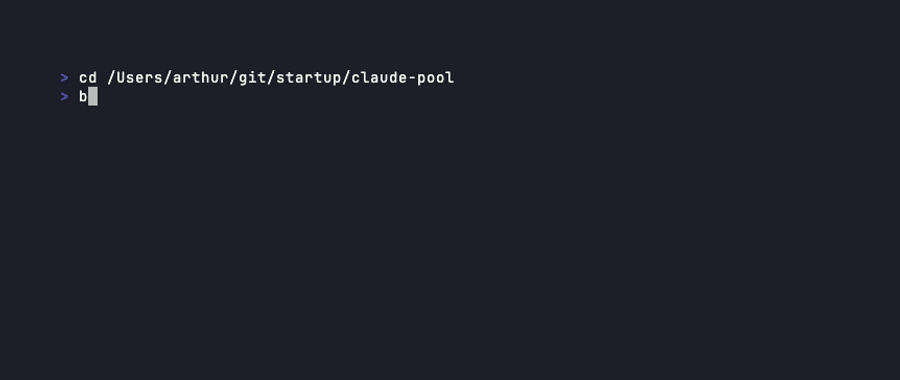

# claude-pool

> Your team hits a Claude Code rate limit. claude-pool silently
> borrows an idle API key from a teammate and keeps going.

[](https://github.com/arthurgarmider/claude-pool/actions/workflows/test.yml)
[](https://www.npmjs.com/package/@claudepool/agent)
[](https://hub.docker.com/r/arthurga/claudepool)
[](LICENSE)



---

## Why claude-pool?

You're 90 minutes into a refactor with Claude Code. It hits a 429. Now you're context-switching for an hour while your teammate's API key sits idle one desk over.

claude-pool fixes that. It's a small self-hosted service that pools your team's Anthropic API keys so any active session can transparently borrow an idle one when it hits a rate limit. No code changes. No new IDE. No telemetry to a third party.

**Built for:**
- Small engineering teams already paying for individual Anthropic API access
- Anyone who has felt the "I just lost my flow because of a 429" pain
- Teams that want failover without giving up audit logs or self-hosting

**Not for:**
- Public exposure (run it behind a VPN — see Security model)
- Pooling personal Claude Code subscriptions across users (likely violates Anthropic's Usage Policy — see OAuth mode section)

---

## How it compares

| | One shared API key | Pay for max plan per dev | claude-pool |
|---|---|---|---|
| Rate-limit recovery | ❌ everyone shares one limit | ✅ but $$$ per seat | ✅ pools existing keys |
| Per-developer billing/audit | ❌ no attribution | ✅ | ✅ `/audit` endpoint |
| Self-hosted | ✅ | ❌ | ✅ MIT, your VPN |
| Credentials encrypted at rest | depends on your setup | ✅ (Anthropic) | ✅ AES-256-GCM |
| Zero workflow change for devs | ❌ rotate by hand | ✅ | ✅ `ANTHROPIC_BASE_URL` |
| Cost | $0 + frustration | $$$$ | $0 + a $5 VPS |

---

## Quick start

### 1. Server — one command on any VPS

```bash
curl -O https://raw.githubusercontent.com/arthurgarmider/claude-pool/main/docker-compose.yml
curl -O https://raw.githubusercontent.com/arthurgarmider/claude-pool/main/.env.example
cp .env.example .env
# Edit .env: set AUTH_SECRET and ENCRYPTION_KEY (use `openssl rand -base64 32` for each)
docker compose up -d
```

### 2. Agent — each teammate installs on their Mac or Linux box

```bash
# Requires Bun: https://bun.sh
bun install -g @claudepool/agent
export ANTHROPIC_API_KEY=sk-ant-api-…
claude-pool init   # enter your server URL and AUTH_SECRET when prompted
claude-pool start  # Claude Code now routes through the pool
```

That's it. Claude Code picks up the pool automatically via `ANTHROPIC_BASE_URL`. No changes to your workflow.

---

## How it works

1. Each teammate runs an **agent** daemon on their Mac or Linux machine
2. The agent runs a local reverse proxy that Claude Code talks through
3. A lightweight **server** tracks who is active and idle, holds encrypted credentials, and arbitrates leases
4. When the proxy sees a 429, it borrows an idle credential from the server, retries, and benches the rate-limited credential for the cooldown window

```
Claude Code → localhost proxy → Anthropic API
                    ↓ (on 429)
              claude-pool server → idle teammate's API key
```

---

## Commands

| Command | Purpose |
|---|---|
| `claude-pool init` | First-time setup |
| `claude-pool start` | Start the agent daemon |
| `claude-pool stop` | Stop the agent daemon |
| `claude-pool status` | Your status + pool stats |
| `claude-pool pool` | All team members and their status |
| `claude-pool logs` | Tail agent logs |
| `claude-pool uninstall` | Full cleanup |

---

## Server API

| Endpoint | Method | Purpose |
|---|---|---|
| `/health` | GET | Liveness probe |
| `/agents/register` | POST | Agent registers (or rotates) its credential |
| `/agents/heartbeat` | POST | Agent reports active/idle |
| `/agents` | GET | Pool view (no credentials) |
| `/agents/:id` | DELETE | Remove an agent |
| `/agents/:id/cooldown` | POST | Bench an agent for `retryAfterSeconds` |
| `/credentials/available` | GET | Borrow a teammate's idle credential |
| `/credentials/lease/:id` | DELETE | Release a lease (`?count=N` records usage) |
| `/credentials/lease/:id/cooldown` | POST | Bench the lender (lease 429'd) |
| `/audit` | GET | Per-lease history (filter `?agentId=`, `?since=`, `?limit=`) |

All routes require `Authorization: Bearer $AUTH_SECRET`.

---

## Security model

- Credentials are encrypted at rest in SQLite using AES-256-GCM under the operator-supplied `ENCRYPTION_KEY`. The plaintext credential only exists in memory on the borrowing agent for the duration of a request.
- Every HTTP route requires a shared `AUTH_SECRET` bearer token. The server is not intended to be exposed to the public internet — put it behind a VPN or private network.
- Lease activity (who borrowed from whom, request count, close reason) is logged and exposed via `/audit`.

---

## OAuth mode (experimental — read before using)

In addition to API keys, the agent can register a Claude Code OAuth token read from your Claude Code login — the macOS Keychain on Mac, or `~/.claude/.credentials.json` (with `secret-tool`/libsecret as a fallback) on Linux.

**Pooling personal Claude Code OAuth tokens across users may violate Anthropic's [Usage Policy](https://www.anthropic.com/legal/usage-policy).** Personal credentials are generally non-transferable.

Only use OAuth mode if at least one of these applies:
- You are the sole human user pooling across machines you own
- Every credential owner has read this section and explicitly consented
- You have written confirmation from Anthropic that your use case is acceptable

To use OAuth mode: run `claude-pool init` without `--api-key-only`. The agent will register whichever of `ANTHROPIC_API_KEY` / Claude Code keychain are available.

When a lender has both an API key and an OAuth token registered, the server prefers the API key when lending.

---

## Requirements

- macOS or Linux (agent — Ubuntu 22.04+, Debian 12, Arch)
- [Bun](https://bun.sh) runtime
- Docker (server)
- An Anthropic API key (`sk-ant-api-…`) per pool member

---

## License

MIT
